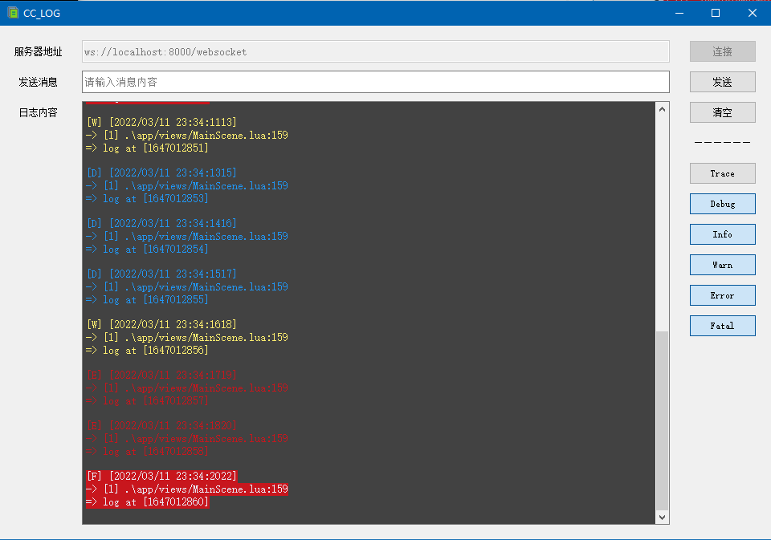

# Console Logger for Cocos2d-x

## 一、介绍

**Console** 是为 Cocos2d-x 制作的日志控制台，通过 WebSocket 来转发日志。

### 特性

- 支持日志等级分类控制
- 支持给客户端发消息，可以自定义指令
- 支持断线重连

## 二、设计架构

### 完整项目流程

- 在 Cocos2d-x 创建 websocket server
- 在 GUI 创建 websocket client
- Lua 层格式化日志消息，通过 websocket 转发给 Console
- Console 收到消息后打印出来

### 完整项目依赖

- Cocos2d-x
    - [cocos2d-x-lws](https://github.com/DoooReyn/cocos2d-x-lws)
    - [lua_format_log](https://github.com/DoooReyn/lua_format_log)
- Console GUI
    - [PyQt5](https://www.riverbankcomputing.com/static/Docs/PyQt5/)
    - [websocket-client](https://github.com/websocket-client/websocket-client)

## 三、截图

